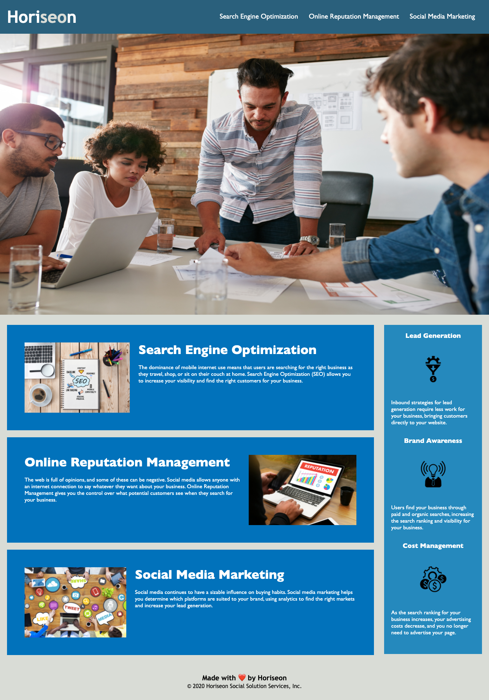

# Horiseon - Marketing Agency (Homework 1)

This is a simple website that details the services provided by Horiseon, a marketing agency. You will find information about what services they provide and the benefits of using their agency.

This homework helped to improve my understanding of CSS elements and properties. It was a good learning experience to also consider accessibility and making sure that all users have a good experience on a website. 

View the website here: 
[Horiseon's website](https://kmwine02.github.io/homework01/)

and the repository here:
[GitHub repository](https://github.com/kmwine02/homework01)

